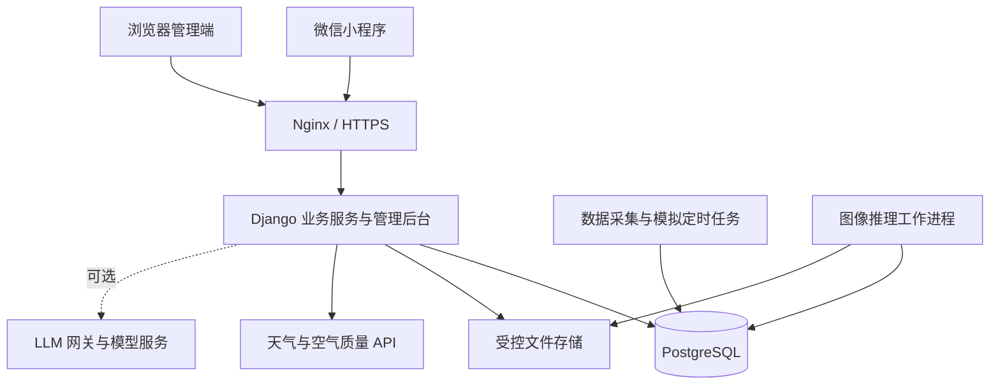

# HYHQ 海晏河清智慧平台开发方案稿

版本：v0.1  
日期：2026-09-16  
状态：M1 本地基础版已实现。按用户要求，M0 外部数据源暂缓，天气、空气与河湖均改为明确标注的模拟数据；正式接入接口继续保留。  
任务清单：[开发目标 TODO](开发目标TODO.md)

## 1. 项目定位与目标

HYHQ 海晏河清智慧平台是一款面向校园及周边河湖、公园场景的生态信息与绿色生活微信小程序。平台整合天气与空气质量服务、可追溯的河湖模拟数据、静态生态导览、轻量图像识别和管理员发布的科普内容，提供环境信息查看、生态学习、绿色游览及个人记录功能。

项目用于课程、毕业设计或比赛演示，以个人主体开发。首版限定一个示范校园及周边区域，采用模块化后端，为真实监测数据、地图服务和可选大模型问答预留接入能力。

### 1.1 核心使用流程

查看天气 → 浏览生态导览 → 进入地点或河湖详情 → 查看指标趋势 → 拍照识别校园植物 → 阅读关联科普 → 收藏或记录游览 → 在个人中心找回记录。

管理员能够维护地点和内容、查看数据来源、运行模拟场景、配置识别模型并检查处理结果。

### 1.2 开发目标

1. 形成用户端、服务端、管理端、数据库和图像推理之间可验证的完整流程。
2. 明确区分实时服务数据、历史公开数据、模拟数据和管理员整理内容。
3. 在现有服务器上完成低并发演示，记录实际资源占用与响应时间。
4. 支持更换数据源、模型和文件存储方式，避免页面依赖某个供应商的原始字段。
5. 交付源码、部署说明、数据与模型说明、验证报告和答辩演示材料。

## 2. 范围与版本划分

### 2.1 V1.0 核心演示版

| 模块 | 首版交付范围 |
| --- | --- |
| 首页 | 选择地区、天气、空气质量、有效气象预警、示范区说明、功能入口 |
| 生态导览 | 一张静态导览图、可点击点位、分类筛选、地点列表与详情 |
| 智慧河湖 | 水温、pH、浊度、溶解氧模拟数据，历史曲线、演示阈值提示 |
| 数据中心 | 指标卡、历史趋势、时间范围选择、来源筛选；与河湖页共用查询服务 |
| AI 识别 | 默认先做校园常见植物分类，含无法确认结果、关联科普与识别记录 |
| 科普智游 | 管理员文章、预设游览路线、地点关联、收藏和游览记录 |
| 我的 | 微信登录、主动设置昵称头像、收藏、记录、隐私设置、注销账号 |
| 管理端 | 用户与权限、内容、地点、监测站、指标、模拟场景、模型版本、统计与日志 |

默认植物识别作为首个任务。M3 首个原型收敛为公开 flower_photos 的五类花卉：雏菊类、蒲公英类、蔷薇属花卉、向日葵类、郁金香类。这些是数据集标签，不是严格的物种或园艺品种鉴定；校园实拍及范围外图片的评估仍待补充。原先建议的 10～20 种校园植物作为后续扩充目标，不能从五类公开数据集成绩推定已实现。

### 2.2 V1.1 及后续增强

- 垃圾物品识别及当地分类规则映射。
- 生态问答、LLM 网关、外部 API 可控调用。
- 本地 Qwen3.5-2B 量化实验；通过测试后按开关启用。
- 更多历史公开数据、真实监测数据接口和实际地图服务。
- 基于定位的到访验证、用户评论与举报流程。

核心演示版不依赖上述增强功能完成。首版采用预设路线与用户自记游览记录，不承诺导航、路线优化或真实到访核验。

### 2.3 功能边界

- 河湖数据为模拟时，所有相关页面、导出及统计均标明模拟来源。
- 暂缓综合生态指数。以后增加时必须说明公式、权重、缺失处理和版本，采用“平台演示评分”等明确名称。
- 当前四项河湖指标用于展示和教学，不输出完整官方水质类别。
- 数据中心采用图表页面，不部署完整 Superset。
- 模型训练在开发电脑或其他算力环境执行，演示服务器负责推理。

## 3. 页面结构与角色

### 3.1 用户端五个一级入口

| 入口 | 子页面与能力 |
| --- | --- |
| 首页 | 地区选择、天气和预警、示范区概况、数据中心入口 |
| 生态导览 | 图片导览、地点列表、地点详情、河湖详情、预设路线 |
| AI 识别 | 图片选择、上传与处理状态、识别结果、关联科普 |
| 科普智游 | 文章列表与详情、植物知识、绿色生活、游览介绍 |
| 我的 | 资料、收藏、浏览/识别/游览记录、隐私、协议、注销 |

用户当前城市与示范区域分别显示。切换天气城市不得自动将示范区河湖数据描述为当地数据。

### 3.2 角色与权限

- 游客：浏览公开地点、科普和环境数据。
- 登录用户：使用需要保存结果或消耗推理资源的功能，管理自己的资料、收藏和记录。
- 内容管理员：维护被授权的内容与地点。
- 系统管理员：管理角色权限、数据源、模拟场景、模型、服务开关和运行日志。

管理员权限与记录归属均由服务端校验。用户不能通过修改请求中的用户 ID 访问他人的识别图片或记录。

### 3.3 管理端范围

采用 Django Admin 起步，为数据看板、模拟运行与识别任务添加必要页面。模型管理先提供版本登记、类别清单、阈值、启停和回退，不建设在线训练平台。用户评论尚未启用时，仅提供简单的问题反馈及处理状态。

## 4. 技术架构与部署

| 层次 | 开发基线 |
| --- | --- |
| 小程序 | 原生微信小程序，建议 TypeScript，图表使用适配微信的 ECharts 组件 |
| 业务服务 | Django + Django REST Framework，按业务域划分模块 |
| 管理端 | Django Admin + 必要的自定义统计页面 |
| 数据库 | PostgreSQL |
| 图片识别 | 独立推理工作进程，优先评估 ONNX Runtime 的 CPU 推理 |
| 定时任务 | Django 管理命令 + systemd timer；保证单实例执行 |
| 接入与进程管理 | Nginx 提供 HTTPS 与反向代理，systemd 管理服务 |
| 文件存储 | 首版受控本地目录，通过存储接口访问；后续可切换对象存储 |
| 可选 LLM | 独立推理服务或外部 API，统一由业务后端网关调用 |

开发启动时锁定互相兼容的 Python、框架与推理依赖版本，通过虚拟环境隔离运行，不随系统 Python 自动升级。前端构建和模型转换在开发环境完成。

### 4.1 小规格服务器运行策略

- 业务 Web 进程不重复加载图像模型；识别请求创建任务，由一个推理工作进程处理。
- 识别并发初始设为 1，配置排队上限、执行超时和线程上限，具体值通过实测确定。
- 定时采集结果按地区缓存，避免每次用户刷新都调用上游 API。
- 历史数据查询限制时间范围与返回点数，长时间跨度使用小时或日聚合。
- 数据库和推理服务只开放内部访问；公开端口按实际需要配置。
- 配置日志轮转、图片清理、磁盘告警、数据库备份及服务重启。
- 本地 LLM 默认关闭；验证其运行不会拖慢普通页面或导致内存不足后再启用。

### 4.2 微信访问前置验证

现有条件仅确认服务器规格和 DNS 已配置，尚未验证 HTTPS、域名备案状态、合法域名、小程序备案、个人主体服务类目及定位能力。

第一阶段需用实际账号和真机验证登录、接口请求、上传、下载及权限拒绝情况。开发工具中关闭域名校验的成功结果不能视为目标演示路径通过。若目标路径不可用，应明确调整域名接入或部署方案；公开发布另行确认对应要求。

## 5. 数据方案与领域模型

### 5.1 数据来源

| 数据 | 接入方式 | 必须记录的说明 |
| --- | --- | --- |
| 天气、湿度、预警 | 选择一个覆盖目标地区的正式 API | 地点、来源、观测/发布时间、有效期、获取状态 |
| 空气质量 | API 提供的 AQI 与污染物字段 | AQI 标准、污染物代码、单位、空间覆盖及缺失字段 |
| 河湖指标 | 定时生成并入库的模拟序列 | 场景、参数、种子、运行批次、生成器版本 |
| 历史数据 | 有明确使用许可的数据集导入 | 原始地点、观测时间、导入时间、原始出处和许可 |
| 地点、文章、路线 | 管理员整理 | 图片与文字来源、更新时间、发布状态 |
| 识别数据集 | 公开许可数据与允许使用的自采图片 | 类别、版本、许可、划分方式与去重说明 |

不预设 VOC 等字段一定可用；缺失数据保留为空值。预警接口请求失败不能显示成“当前无预警”，旧预警不得当作正在生效的信息继续展示。

### 5.2 核心实体

| 实体组 | 主要职责 |
| --- | --- |
| 用户、会话、角色 | 登录身份、资料、令牌失效、权限 |
| 区域、地点、水体、监测站 | 校园/城市范围、导览点位及河湖和监测关系 |
| 底图、点位布局 | 底图版本、相对坐标、关联地点 |
| 指标定义、数据源、观测记录 | 指标代码与单位、来源、观测值与质量状态 |
| 模拟场景、模拟运行 | 场景参数、种子、批次、重放与版本 |
| 内容、路线、路线节点 | 科普文章、地点/植物关联、预设游览顺序 |
| 模型版本、类别映射、识别任务 | 模型制品、输入约定、任务状态、结果及耗时 |
| 收藏、浏览记录、游览记录、反馈 | 用户行为与问题处理 |
| 操作日志、任务日志 | 管理变更、数据处理、失败原因与耗时 |

一条河湖可关联多个监测站，一个监测站可包含多种指标。图上地点与监测站不强制一一对应。

### 5.3 观测数据契约

统一字段包括：`station_id`、`metric_code`、`value`、`unit`、`observed_at`、`ingested_at`、`source_id`、`source_type`、`quality_status`，模拟数据增加 `simulation_run_id`。

- `source_type` 固定为 `api / dataset / simulation / manual`；页面模拟标记根据来源生成。
- 观测时间与导入时间分别保存；服务端统一时间存储，展示时转换为明确时区。
- 缺失值为 `null`，并记录质量状态；不能以 0 填充缺失观测。
- 导入与生成制定去重键，重复执行不会产生同一批次的重复观测。
- 查询、聚合、导出均显式限定来源；不将真实值与模拟值合并为一个未说明的指标。
- 第一版对来源有明确标识；真实接口失败时显示过期缓存或暂不可用。手动进入演示模式后才可使用模拟替代，并明显标记。

### 5.4 模拟生成规则

以基准值、日周期、小幅噪声和上下限生成连续数据，按固定采样间隔入库，页面刷新只查询。至少支持正常波动、突发浑浊、数据缺失三类场景；固定种子和版本后可以重放。

阈值提示关联具体指标和规则版本，明确标为模拟场景提示，与官方气象预警分开。场景只用于验证系统行为，不声称能够准确模拟自然环境的因果关系。

### 5.5 静态导览

点位保存 `map_id`、`place_id`、`x_ratio`、`y_ratio`，位置相对底图内容区域计算，缩放时同步变换。可选保存经纬度与坐标系，用于后续地图接入。底图与点位布局绑定版本，避免替换图片后点位错位。

## 6. AI 识别与问答方案

### 6.1 首个识别任务

首轮比较 MobileNetV3-Small 与 EfficientNet-B0：使用 ImageNet 预训练主干提取冻结特征，在统一的去重分组划分上训练分类头，以验证集选择模型和阈值。独立测试集只用于最终报告。第一版限定照片中一个主要花卉主体；多目标画框检测留待明确需求后再评估 YOLO。

训练数据来自 TensorFlow 官方 flower_photos 归档，逐图作者、原链接和 CC-BY 许可随清单保留。原始照片、特征缓存和模型权重不进入源码仓库。公开数据集分数用于评估五类范围内的原型，不代表校园照片、其他植物或垃圾识别效果。高分也可能是范围外图片的误判，阈值不能保证拒绝所有未知对象。

流程：登录用户上传图片 → 服务端校验并创建任务 → 工作进程预处理与推理 → 保存模型版本、候选结果与分数 → 返回识别状态及关联科普。

- 任务状态统一为 `queued / running / succeeded / failed`，失败包含稳定的错误代码。
- 业务结果支持已识别、无法确认和不支持的类别；低分结果不能强行输出确定结论。
- 模型登记包含权重来源、许可、类别映射、预处理步骤、阈值和制品校验值。
- 分数用于排序和阈值判断，未经校准不表述为实际正确概率。
- 数据集先去重，再划分训练、验证和测试集；阈值根据验证集确定。
- 独立测试集和校园实拍样本记录准确率、宏平均 F1、混淆矩阵、推理延迟、峰值内存及失败例子。

### 6.2 可选 LLM 网关

网关配置包括服务方、模型、密钥引用、超时、上下文和输出长度、用户额度、全局预算与开关。

优先通过关键词、标签和地点关联查找已发布资料；启用 LLM 后，将必要资料提交给模型并在答案中提供可核对来源。外部 API 必须同时满足启用状态、可用凭据和预算条件；不能因本地失败就无条件调用付费服务。

本地 Qwen3.5-2B 使用兼容的量化方案，先验证纯文本、短上下文、单请求。记录模型与运行时版本、配置、首字延迟、完整响应时间和整机峰值内存。测试不达标时关闭本地服务，保留检索结果和不可用提示。

问答不能把模拟数据描述成实测结果；模型调用只传所需资料，不附带 OpenID、无关用户资料或原始位置轨迹。

## 7. API 与扩展约定

API 统一使用 `/api/v1/` 前缀，示例资源包括：

| 资源 | 职责 |
| --- | --- |
| `/auth/wechat`、`/me` | 登录换取业务会话、当前用户及账号生命周期 |
| `/regions`、`/places`、`/maps` | 区域、地点、底图及点位 |
| `/weather`、`/air-quality`、`/weather-alerts` | 地区环境摘要与请求状态 |
| `/stations`、`/observations`、`/dashboard` | 监测站、受限时间序列与聚合 |
| `/contents`、`/routes` | 内容与预设路线 |
| `/recognition-jobs` | 上传创建任务、查询进度和结果 |
| `/favorites`、`/histories`、`/visits`、`/feedback` | 用户记录与反馈 |
| `/assistant` | 后续可选问答接口 |

错误格式、鉴权、分页、时间格式和来源元数据保持一致。数据采集、模型推理和文件存储通过明确的内部接口替换实现，不提前引入复杂插件系统。

## 8. 隐私、文件与运维

- 微信登录只用于建立身份，昵称头像由用户主动设置。微信 AppSecret、上游 API 密钥只保存在服务端，日志脱敏。
- 定位按功能需要触发；拒绝授权仍可手动选地区并浏览内容，不持续采集位置。
- 图片限制文件类型、体积和解码尺寸，服务端实际解码校验、移除不必要元数据，使用随机存储名。
- 用户图片采用鉴权访问；识别记录与文件的删除、过期清理保持一致。
- 开发基线建议：识别原图保留 24 小时，缩略图及识别记录保留 30 天；收藏保留至用户删除。具体策略在开发前确定并与页面说明一致。
- 注销后立即使会话失效，删除或按明确规则处理用户关联记录和图片；备份中的保留及过期策略单独说明。
- 备份覆盖数据库与需要保留的内容资源，至少保有服务器之外的一份恢复材料，并在交付前完成一次恢复验证。

## 9. 交付与验收

### 9.1 核心版本完成条件

1. 目标账号和目标真机上能够完成核心流程；访问方式与任何限制有记录。
2. 管理员修改地点或发布文章后，用户端能看到更新。
3. 模拟数据可重放，来源、单位、时间和质量状态显示正确。
4. 一个真实图像模型完成推理，保留独立测试结果；不能用固定答案替代模型结果。
5. 收藏、记录、权限、删除、注销和失败处理可实际演示。
6. 在 2 核 4GB 环境下完成普通浏览与识别同时运行的测试，报告实际值。
7. 部署重启后能恢复服务，数据库与资源可从备份恢复。
8. 提供源码、配置示例、部署指南、数据清单、模型评估报告和演示脚本。

### 9.2 建议测试口径

以下是初始验收目标，不代表已测性能；调整时必须记录原因。

- 5 个并发浏览用户并同时提交 1 个识别任务，持续运行 30 分钟，无进程崩溃或内存不足终止。
- 缓存命中的普通读取 API，服务端响应 p95 不超过 1 秒；真机端到端耗时单独记录。
- 单张图片在任务开始执行后 10 秒内给出结果或明确失败；上传耗时、排队时间分别记录。
- 演示全过程页面均能呈现加载、空数据、错误和重试状态。
- 服务重启后的在途识别任务能够恢复或进入明确失败状态，不永久停在处理中。
- AI 准确率目标在类别与数据集冻结后、查看最终测试结果前确定。

## 10. 开发前待决事项

| 项目 | 当前状态 | 决策节点 |
| --- | --- | --- |
| 示范校园、城市与点位 | 待选定 | M0；可先用标注清楚的示范资料 |
| 账号能力、域名和演示访问方式 | 待实际验证 | M0，主链路验证通过后冻结 |
| 天气与空气质量服务商 | 待确认覆盖、字段、许可和额度 | M0 |
| 植物类别与训练数据 | 默认植物优先，清单待确定 | M0 盘点，M3 训练前冻结 |
| 图片与记录保留期限 | 已给出建议值，待落实到配置和隐私说明 | M1 |
| 演示规模与性能目标 | 使用本稿建议值 | M0 确认，M4 实测 |
| 外部 API 凭据与预算 | 未配置，功能默认关闭 | M5 |

## 11. 参考资料

以下资料用于说明方案依据；账号实际能力和接入条件以开发时验证为准。

- 小程序接口域名与 HTTPS 接入：[阿里云小程序后端部署说明](https://help.aliyun.com/zh/ecs/user-guide/develop-your-wechat-mini-program-in-10-minutes)。
- 小程序备案与公开服务条件：[工信部 APP 备案通知](https://www.miit.gov.cn/zwgk/zcwj/wjfb/tz/art/2023/art_920db564162e4312916a01bed6540ad8.html)。
- 数据中心以组件实现图表：[ECharts 微信小程序组件](https://github.com/ecomfe/echarts-for-weixin)；部署取舍参考 [Superset FAQ](https://superset.apache.org/user-docs/faq/)。
- 内部管理后台采用现有能力：[Django Admin 文档](https://docs.djangoproject.com/en/5.2/ref/contrib/admin/)。
- 图像推理限制线程：[ONNX Runtime 线程管理](https://onnxruntime.ai/docs/performance/tune-performance/threading.html)。
- 本地模型需量化实测：[Qwen3.5-2B 官方权重与说明](https://huggingface.co/Qwen/Qwen3.5-2B/tree/main)。
- 天气数据服务候选：[空气质量接口](https://dev.qweather.com/en/docs/api/air-quality/air-current/)、[气象预警接口](https://dev.qweather.com/docs/api/warning/)。
- 河湖指标展示与完整评价的边界：[地表水环境质量标准](https://www.mee.gov.cn/ywgz/fgbz/bz/bzwb/shjbh/shjzlbz/200206/t20020601_66497.shtml)。
